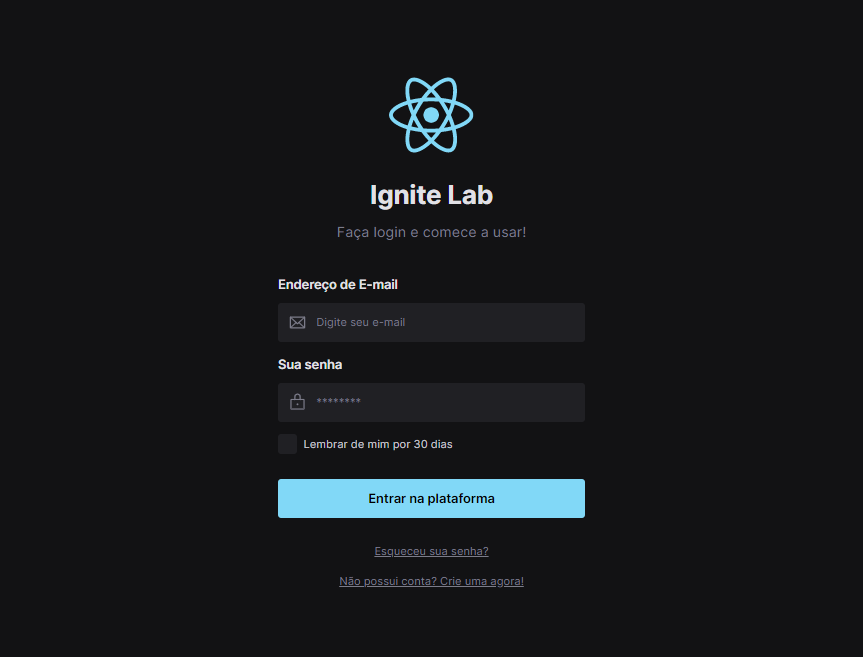

# 🚀 Projeto IgniteLab Design System - Do Figma ao React

 ## 🛠 Tecnologias  
  - HTML e CSS
  - React + Vite
  - TypeScript + JavaScript
  - Tailwind
  - Storybook

  ## 📚 O que aprendi 
- Figma
> Pude aprender sobre componentização, criação de tokens e DesignSystem.

- Desenvolvimento
> Tive meu primeiro contato com React, Vite, Tailwind e também Storybook.

[🔗 Clique aqui para acessar o Storybook](https://caminsk.github.io/lab-ds/?path=/story/example-introduction--page)

